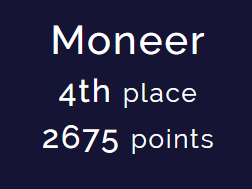
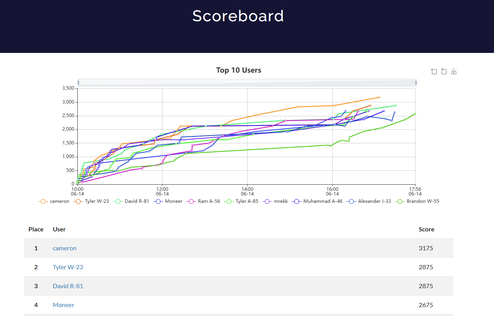
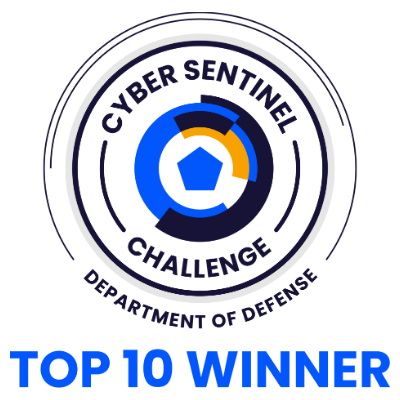

# DoD Cyber Sentinel Challenge - June 2025 Write-ups

  <table>
    <tr>
      <td></td>
      <td></td>
      <td></td>
    </tr>
  </table>

  <strong>Final Placement: 4th Place out of 2,156 Participants (Top 0.18%)</strong>

---

## 1. Overview

Welcome to my repository for the June 2025 DoD Cyber Sentinel Challenge. This was a timed, 8-hour Capture the Flag (CTF) competition where I earned **4th place** among 2,156 competitors.

This repository serves two purposes:
*   To document my solutions and thought processes for the challenges I solved.
*   To outline the strategic methodology and AI-assisted workflow I employed to achieve this result.

## 2. Methodology & Approach

Success in a time-constrained CTF is a product of speed, accuracy, and a repeatable methodology.

### Core Principles
My strategy was built on two core principles:
1.  **The "Golden Hour":** I secured an early leaderboard position by rapidly solving all seven "Very Easy" challenges to build an immediate point base and momentum.
2.  **No Hints Used:** I made a strategic decision to complete the entire competition **without using a single hint.** This forced a deeper reliance on fundamental skills and a robust problem-solving process, which proved to be a key factor in my final placement.

### The "Partner, Scrutinize, Guide" AI Workflow
I leveraged a powerful AI assistant not as an automatic solver, but as a junior partner to accelerate analysis. This workflow was essential for maintaining speed while avoiding the pitfalls of AI hallucinations.
*   **Partner:** For each new challenge, I would provide the AI with all available data and ask it to generate a high-level **plan of attack**.
*   **Scrutinize:** I would **personally execute** the plan's first step in my Kali VM to generate real-world output.
*   **Guide:** I then fed this **actual, verified evidence** back to the AI, correcting its assumptions and guiding its analysis toward the next logical step.

### My Tool Arsenal
While my pre-competition research included a wide range of specialized web tools, I found that the challenges were best solved through direct, hands-on analysis within a stable Kali environment. My most-used tools were:
*   **Recon & Enumeration:** `nmap`, `feroxbuster`
*   **Web Analysis:** `Burp Suite`, Browser DevTools
*   **Forensics & RE:** `Volatility3`, `exiftool`, `zsteg`, `objdump`
*   **Scripting & Exploitation:** `pwntools`, `Python`
*   **AI assistants:** `Gemini 2.5 Pro`, `OpenAI o3`, `o4-mini-high`

## 3. Challenge Write-ups

Here are the detailed write-ups for some of the challenges I solved during the competition:

- [Decryption Conniption](writeups/decryption_conniption.md) - Forensics (300 points)
- [Iron Potato Delicacy](writeups/iron_potato_delicacy.md) - Crypto/Steganography (300 points)
- [overSSHaring](writeups/over_ssharing.md) - Networking (200 points)

## 4. Key Takeaways

*   **A Stable Environment is Non-Negotiable:** The extensive pre-competition work to troubleshoot and build a reliable VM was the foundation for success.
*   **Methodology Over Memorization:** A repeatable workflow is more valuable than simply knowing hundreds of commands.
*   **AI as a Force Multiplier:** When properly guided and verified, LLMs can dramatically accelerate the process. The human operator's role shifts from manual execution to strategic direction and critical thinking.

---

## Appendix

*   [Master Prompt v2.1](docs/master_prompt.md) — the exact instructions I gave my AI assistant

---

### Connect with Me
*   **LinkedIn:** [linkedin.com/in/moneers/](https://www.linkedin.com/in/moneers/)
*   **GitHub:** [github.com/Moneer-S](https://github.com/Moneer-S)
