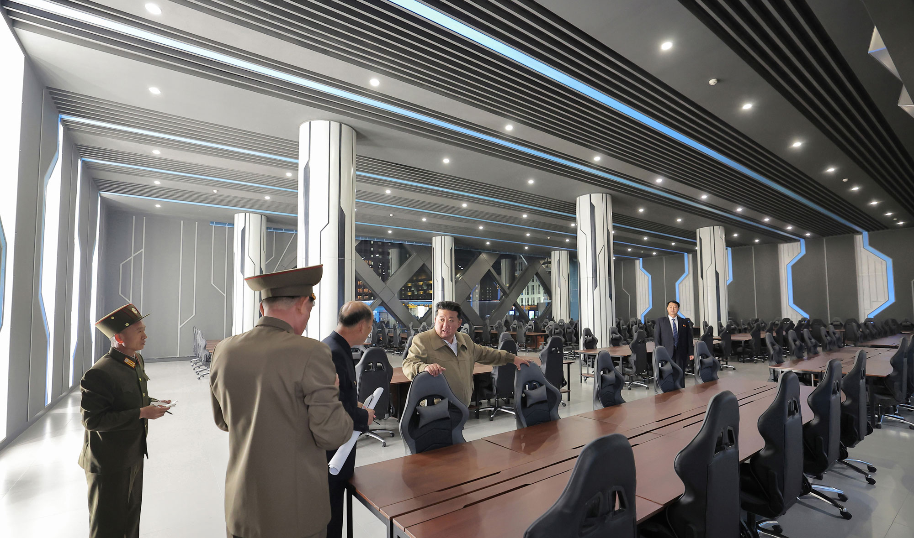

# Inspo — OSINT Write‑Up

> **Category:** OSINT / Geolocation   |   **Points:** 200 (Medium)

---

## 0  Scenario Overview

> *Prompt excerpt*: "We believe that the North Torbians are heavily influenced by North‑Korean developments. … Can you find the **coordinates** of where these pictures were taken?\
> Flag must be any decimal‑degree coordinate within **500 m** of the building, formatted `C1{XX.XXX,YY.YYY}`."

I received **two ground‑level photos** of Kim Jong Un inspecting a futuristic gateway arch and a "300‑seat gaming center." My job was to locate that exact arch in Pyongyang and submit a valid coordinate flag.

---

## 1  Initial Clues — Reverse‑Image Rabbit Hole

**Provided Photos:**

<p align="center">
  
  <br><em>Photo 1: Walking towards the futuristic gateway arch</em>
</p>

<p align="center">
  
  <br><em>Photo 2: Inside the 300-seat gaming center</em>
</p>

A reverse‑image search on the second shot surfaced **KCNA + Vietnamese tech blog** articles describing a "300‑seat game center" in **Hwasong District, Pyongyang** (stage 3 of a 10,000‑apartment project). That gave me a district name but no precise coordinates.

---

## 2  Press‑Release Aerial — The Missing Map Piece

Those articles included an **aerial press‑release photo** showing the boulevard, gateway arch, and **two distinctive red‑topped towers** just northwest of the arch:

<p align="center">
  
  <br><em>KCNA aerial photo showing the gateway arch and distinctive red-topped twin towers</em>
</p>

This single image became the ground‑truth fingerprint.

---

## 3  Map Hunt & Frustrations

I loaded **Google Earth**, only to find the publicly available satellite imagery was **out‑of‑date**; Hwasong Stage 3 appeared as a construction site. I spent hours:

- Jumping between labelled blocks in Hwasong, Mirae, Songhwa Streets.
- Measuring road widths to match the arch's boulevard.
- Searching Pyongyang–Huichon Expressway exits for anything resembling that clock arch.

Every attempt failed because nothing was labelled and the imagery pre‑dated the completed district.

---

## 4  Breakthrough — Trust the Towers

Recalling the two red‑topped towers from the KCNA aerial, I scanned the **construction footprints** in Google Earth for a pair of matching tower foundations northwest of a wide boulevard. Finally, I spotted them just east of the Hapjang River — the only place where two mirror‑image pads sat beside an unpaved median capable of hosting an arch.

<p align="center">
  
  <br><em>Google Earth view showing the twin tower foundations and boulevard where the arch was located</em>
</p>

That spot's coordinates were:

- **Lat:** 39.0655 °N
- **Lon:** 125.8225 °E

---

## 5  Flag

Rounding to three decimals (within < 100 m):

```text
C1{39.066,125.823}
```

Submitting that string cleared the challenge.

---

## 6  Lessons Learned

| Takeaway                               | Why it mattered                                                                     |
| -------------------------------------- | ----------------------------------------------------------------------------------- |
| **Reverse‑image search first**         | Surfaced the KCNA article and vital aerial photo.                                   |
| **Outdated imagery ≠ useless**         | Foundation "ghosts" of the twin towers matched the finished skyline.                |
| **Anchor on unique landmark clusters** | The arch *plus* twin red‑topped towers eliminated all look‑alikes.                  |
| **OSINT = patience**                   | Persistence paid off once the visual constellation was trusted over missing labels. |

